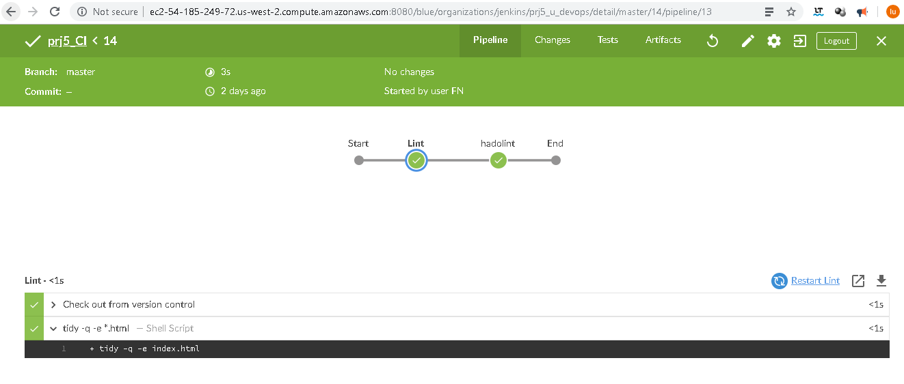
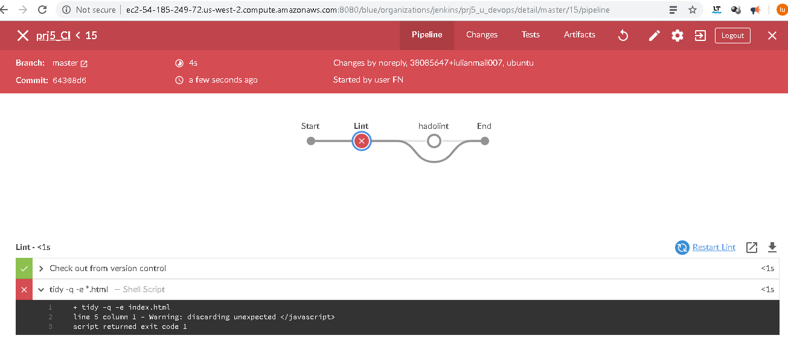
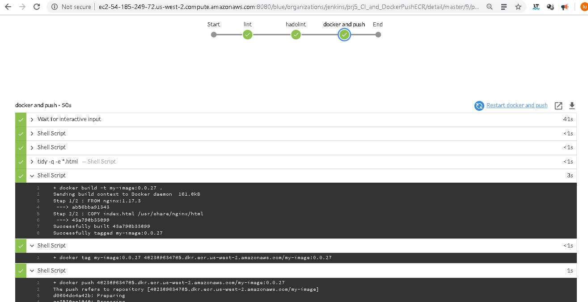
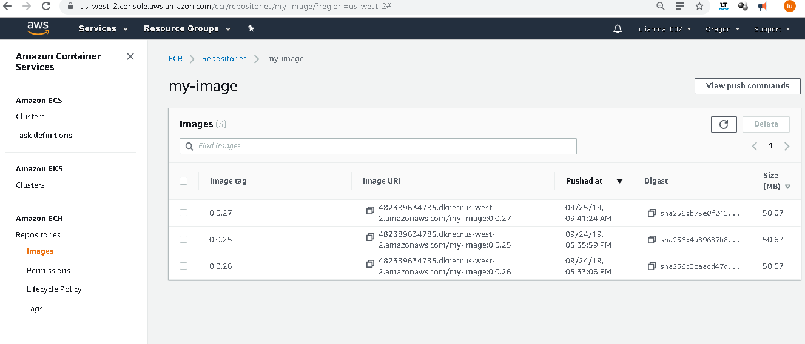
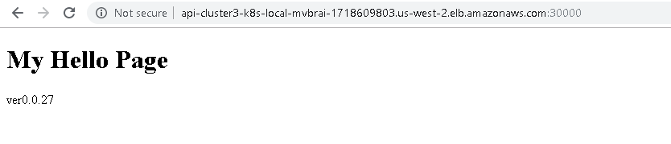
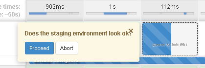
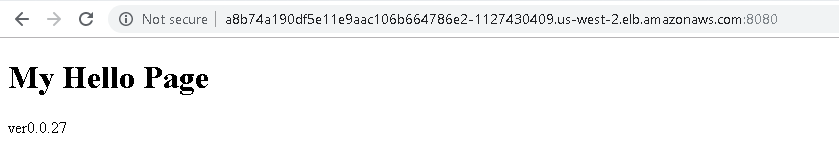

# Project

1 Project Scope:
-------------------------------------
Jenkins  with next pipelines:
-Jenkinsfile_CI: lint and hadolint checks
-Jenkinsfile_CD_Docker_ECR : CI steps and docker image creation; this will be pushed in an ECR repository
-Jenkinsfile_CD_bgDeployment : a repository image will be deployed in one cluster; blue/green deployment will be used

Docker application: Nginx with a .html page


2 Environment
-------------------------------------
About Jenkins 2.176.3 with Open Blue Ocean  plugins are available

An aws cluster was created with kops:

https://github.com/kubernetes/kops 
```
kops create cluster \
    --zones us-west-2a \
    --name cluster3.k8s.local \
    --state=s3://cluster3.k8s.prj5  \
    --node-count=3 \
    --node-size=t2.micro \
    --master-size=t2.micro –yes
```
As CloudFormation.json this looks like: https://github.com/iulianmail007/prj5_u_devops/tree/master/initial_env/cloudformation_kb8.json 

3 Initial cluster config:
-------------------------------------
https://github.com/iulianmail007/prj5_u_devops/tree/master/initial_env 

```
kubectl create -f blue.yml
kubectl create -f green.yml
kubectl create -f srv-lb.yml
kubectl create -f erv.yml
```

The cluster will contain two environments – two ReplicationController, each with two pods (RC blue and RC gree) This will be exposed with a LoadBalancer (for the prod environment, RC) and NodePort (intern om port 30000 for the other environment., RC)

4 Pipelines
-------------------------------------
-Jenkinsfile_CI: lint and hadolint checks
Repository: Jenkinsfile_CI

successful CI


failed CI


-Jenkinsfile_CD_Docker_ECR : CI steps and docker image creation; this will be pushed in an ECR Repository
Repository: Jenkinsfile_CD_Docker_ECR

The file https://github.com/iulianmail007/prj5_u_devops/blob/master/Dockerfile 
will be used to create a containerized image of the application.
This will be built, tag and pushed on the ECR repository





-Jenkinsfile_CD_bgDeployment : a repository image will be deployed in one cluster; blue/green deployment will be used
Repository: Jenkinsfile_CD_bgDeployment

 will be identified and the other RC will be re-deployed a staging environment with the new version 0.0.27.
The process will be paused so the operator can test the staging environment. 
If this is ok:
- he can choose to proceed (The Productive LB will be Link to this environment → prod and the other one with the NodePort)
- he can abort and eventually try with a new deployment of a new image.

Find the produntiv environment blue or green:
```
kubectl get --no-headers=true service/my-srv-lb -o custom-columns='SELECTOR:spec.selector.app' 
```

Make blue staging after succesfilly test productiv:
```
kubectl patch service/my-srv-lb -p '{"spec":{"selector":{"app": "blue"}}}' 
```

For our example:
The new version is in staging for tests available

After Proceed is this version also Prod

